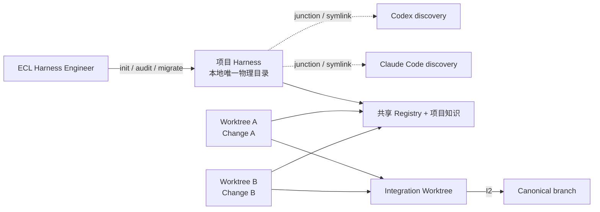
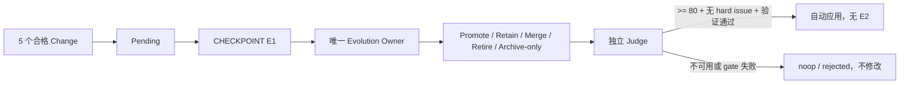

# ECL Harness Engineer


为任意项目创建一个项目绑定的本地 Harness，让 Codex、Claude Code 和多个本地
worktree 共享同一套项目知识、协作事实与演进规则。


```bash
npx skills add qinghui316/ecl-harness-engineer
```

项目已被 [Antigravity Awesome Skills](https://github.com/sickn33/antigravity-awesome-skills)
收录：[PR #678](https://github.com/sickn33/antigravity-awesome-skills/pull/678)。

## 工作方式

ECL Harness Engineer 分析项目并执行四类项目 Harness 操作：

1. `init`：从真实代码、文档和验证命令初始化项目 Harness。
2. `audit`：检查知识漂移、Registry、运行时链接和流程 gate。
3. `migrate`：用新的分析 bundle 原子更新已有项目 Harness，并保留动态状态。
4. `doctor`：机械检查安装、Runtime、链接、Lane、baseline、锁和恢复状态；完整知识、ECL 和规则检查由 `audit` 聚合。

项目 Harness 负责日常 Change、worktree 协作、Integration 和每五个 Change 的轻量进化。

## 项目结构



项目 Harness 默认位于：

```text
<primary-worktree>/.agents/skills/<project-id>-harness/
```

这个目录通过 Git common dir 绑定项目身份，并写入 common `info/exclude`，因此不会进入业务
Git。主工作树的 Codex 直接读取该物理目录；Claude Code 和其他 worktree 使用项目级链接，
不复制两套规则：

| Runtime | 每个 worktree 的项目级发现目录 |
| --- | --- |
| Codex | `<worktree>/.agents/skills/<project-id>-harness` |
| Claude Code | `<worktree>/.claude/skills/<project-id>-harness` |

业务仓库只提交精简路由、一个宿主可运行的
`scripts/harness-skill-link.{ps1|mjs|py}` 和正式业务文档/代码。Change 证据全部位于共享的
project Harness。新 worktree 先从 `AGENTS.md` 运行 connector；
`project doctor --repair-links` 可补齐所有已存在 worktree 的链接。项目 Harness 不创建自己的
Git、快照、回滚服务或守护进程。

## 生成目录

```text
<project-id>-harness/
├── SKILL.md
├── references/
│   ├── project_wiki/
│   │   ├── overview.md              # L1
│   │   ├── modules/                 # L2 业务/基础设施模块
│   │   ├── systems/                 # L2 环境、命令、验证
│   │   ├── bridges/                 # L3 语义桥
│   │   ├── reference_projects/      # 参考源码索引与证据地图
│   │   └── index.json
│   ├── workflows/
│   ├── runtime-modules.md          # helper 维护与 traceback 定位，普通任务不读取
│   ├── audit-rubric.json           # 审计权重与 Evolution 发布门禁
│   └── rules/
│       ├── red_lines.yaml           # 唯一机器真源
│       ├── critical.md              # 脚本派生
│       └── by-stage/                # 脚本派生
├── scripts/
│   ├── harness_cli.py
│   ├── build_analysis_bundle.py    # draft evidence extractor; copied for project Harness E1
│   ├── render_greenfield.py        # approved bootstrap Change only
│   ├── generate_rule_docs.py
│   ├── check_project_wiki_stale.py
│   ├── check_stage_artifacts.py
│   ├── harness_runtime/            # CLI 内部实现包；公开入口仍是 harness_cli.py
│   └── harness-{project|change|integrate|evolve|knowledge}.{ps1|cmd|sh}
├── assets/templates/
└── state/
    ├── manifest.json
    ├── analysis/
    │   ├── project-profile.json
    │   ├── audit.json
    │   ├── creation-delta.json
    │   └── architecture.json
    ├── changes/
    │   ├── active/
    │   ├── parking/
    │   ├── archive/
    │   └── INDEX.json
    ├── registry/
    │   ├── lanes/
    │   ├── changes/
    │   ├── contracts/
    │   ├── integrations/
    │   └── baseline.json
    └── evolution/
        ├── state.json
        ├── pending.json
        ├── proposals/
        ├── staging/
        └── results.tsv
```

### 分层知识

- L1 `overview.md`：默认读取的项目地图，按项目复杂度扩展，不设固定字节或行数上限；实现
  细节通过 L2/L3 分流，但默认发现所需的项目级导航必须完整保留。
- L2 `modules/`：只有代码结构、模块 README、manifest 或正式文档能够证明时才创建。
- L3 `bridges/`：产品词到代码名、API/schema/event/config、设计 Token 等真实语义桥；没有
  引用就不生成。
- `reference_projects/`：用户明确引入的参考源码地图。相关 L2/L3 直接写明参考机制、适配
  和边界，Agent 顺着文档引用进入地图和源码，不使用额外加载门禁。
- `index.json`：脚本生成，记录来源与内容指纹，禁止手改。

参考源码默认位于主工作树 `.agents/reference-projects/<reference-id>/`，由 Git common
`info/exclude` 排除，所有 worktree 通过同一项目 Harness 读取其地图。已有项目内 submodule
可原地绑定。不会自动拉取或更新参考项目。

## 多 Worktree 如何协作

一个长期 worktree 是一个 Lane，可以顺序完成多个 Change。每个 Change 仍是一项独立任务。

| 信息 | 所有 Lane 是否立即可见 | 所有者 |
| --- | --- | --- |
| 当前 scope、路径声明、contract、commit、验证 | 是 | 共享 Registry |
| `summary/spec/plan/tasks/review`、parking、archive、INDEX | 是 | 共享项目 Harness Change state |
| 正式架构、API、业务文档 | canonical 落地后可见 | Canonical branch |
| Harness 规则和 AI 项目知识 | 是 | 本地项目 Harness |

API、schema、event、config、权限或模块边界变化必须发布机器可读 contract。其他 Worker 在
每个阶段 preflight；只有相关冲突或 baseline 变化使当前计划失效时才暂停重规划。

L1/L2/L3 是每五个合格 Change 由 Evolution 刷新的周期性索引，最多可能滞后四个已集成
Change。preflight 会读取 Change base 之后的 baseline events、完整 contract 快照、affected
paths 和相关知识来源漂移：命中当前 scope 时返回 `refresh-needed + replan`。最新事实优先级
固定为 Registry event/contract、当前分支 Change、canonical 代码/正式文档、最后才是 Wiki；
无关 baseline 前进不会阻塞 Lane。

## Change 与精确完成提交

Git Change 使用两阶段关闭，把共享证据与业务实现的精确提交绑定：

1. `change prepare-close` 校验共享证据和验证结果，将 Change 置为 `closing`，证据仍在项目
   Harness 中。
2. Worker 只提交业务实现，得到 clean HEAD。
3. `change close --completion-commit <head>` 验证 ancestry、clean HEAD 和证据，将证据移入
   Change archive、重建 INDEX，并记录精确 `completion_commit`。

非 Git 项目使用 `single_lane`，一次 close 完成，不会自动执行 `git init`。

## 本地 PR 式 Integration

Integration 只在用户要求合并时开始：

1. 从 Registry canonical baseline 创建临时 worktree。
2. 对每个被选 Change 只应用线性的 `base_commit..completion_commit` 区间。
3. Integrator 可以解决冲突、补兼容代码并提交额外修改。
4. 运行聚合验证和独立 review。
5. `CHECKPOINT I2`：用户确认后才落到 canonical。
6. 按 `pre_merge -> canonical_landed -> registry_committed -> cleanup_complete` 更新 baseline、
   Integration Record、Change 集成状态和 evolution signals，再清理 worktree。

这能保证长期 Lane 中选择 Change B 时，不会因为合并整个分支 tip 而误带 Change A。
Integration 不更新 L1/L2/L3；稳定知识只在 init、migrate 或 E1 Evolution 的完整重分析中
更新。

merge 前失败会释放 writer 并回到 review；canonical 已落地后的失败会保留 writer 和恢复
阶段，重试只补未完成的 Registry/cleanup。`project doctor` 会报告 recovery owner 和 stale
writer，已落地 Integration 禁止 abort。

## 每五个 Change 的轻量进化

全项目累计五个唯一、completed、validation-passed、evidence-complete 的 Change 后生成
pending。Integration Record、Evolution 工作和没有正式 Change 的小任务不计数。



Owner claim 会记录当前 Harness 内容指纹并冻结本轮 Change IDs；进化期间新完成的 Change
排入下一窗口。发布前重新计算候选指纹；通过 project Harness 根目录的可恢复事务切换内容，并把
当前动态 `state` 原样移入新根，因此不会用候选中的旧 Lane、Change、contract、Integration
或 baseline 覆盖 Registry。临时 journal/previous/state snapshots 只服务本次 commit/rollback，
不是版本或快照产品。`noop/rejected` 必须保持指纹不变，`keep` 必须确实产生变化。project
Harness 不依赖 Darwin；Darwin 只用于 ECL Harness Engineer 自身的外部质量评估。

## 快速使用

在目标项目中对 Agent 说：

```text
Use ecl-harness-engineer to initialize a project-bound local Harness for this project.
```

已有项目 Harness 需要刷新时：

```text
Use ecl-harness-engineer to audit this project Harness and migrate it from a fresh evidence-backed analysis bundle.
```

日常命令面：

```text
harness-project audit|doctor
harness-change new|preflight|publish|status|park|resume|prepare-close|close|search|context|reindex
harness-integrate start|status|complete|abort
harness-evolve check|status|stage|mark-complete
harness-knowledge scan|check
```

`knowledge scan|check` 只在怀疑漂移、preflight 命中相关漂移、audit/migrate 或 E1 时运行。
两者不写项目知识；健康返回 0，发现问题返回 1，命令或事务错误返回 2。

`project init|migrate` 由 ECL Harness Engineer 执行。项目 Harness 自带四文件 analysis
contract 和 draft 证据提取器；Agent 完成语义复核后可独立执行只读
`project audit --analysis-bundle ...`，并在 E1 中生成和校验候选。

空项目初始化只生成诚实的通用 bootstrap reference。用户确认语言与 CLI/Web API 类型后，
项目 Harness 在 plan 批准后通过自带的 `scripts/render_greenfield.py`，从 Go、TypeScript、
Python 六种成熟模板中只选择一套向空的 Worker 输出生成起点；Worker 再通过 Structured
Change 审查和完成真实业务源码、测试、项目命令、文档和可选 Make/package/CI。

`project audit` 不带 analysis bundle 时只检查已安装项目 Harness 的结构、链接、Registry
和漂移状态；带新的四文件 analysis bundle 时，还会校验当前项目语义、架构、审计
维度和 creation delta，但始终不发布内容。

## 明确边界

- 只解决本地多 Agent/worktree，不解决跨机器多人实时同步。
- 不启动 daemon、scheduler 或远程锁服务。
- 不自动初始化 Git，不自动合并业务代码，不绕过测试。
- 不把机器绝对路径写进业务仓库跟踪文件。
- 不从文章或单次经验直接晋升长期规则。
- 不把数百个 archive 全量加载或复制进当前项目知识。
- 所有外部 Change/Integration/Evolution id 先校验再进入路径；已有 AGENTS/CLAUDE 使用有界
  managed block 幂等合并，connector 路径冲突不会静默覆盖。

## 本仓库验证

```powershell
python -m py_compile scripts/harness_cli.py
python -m unittest discover -s tests -v
python <skill-creator>/scripts/quick_validate.py .
```

GitHub: [qinghui316/ecl-harness-engineer](https://github.com/qinghui316/ecl-harness-engineer)
