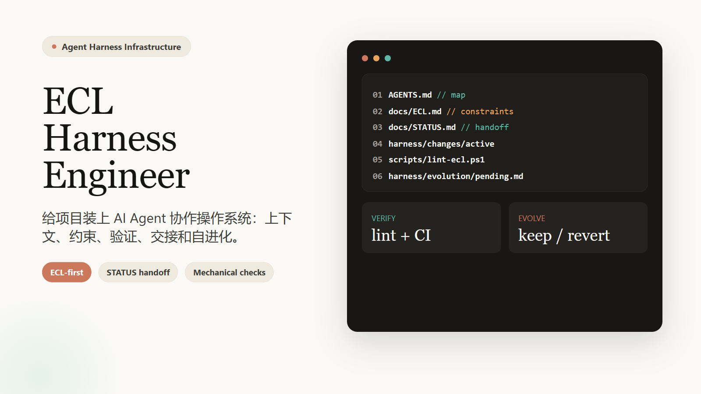
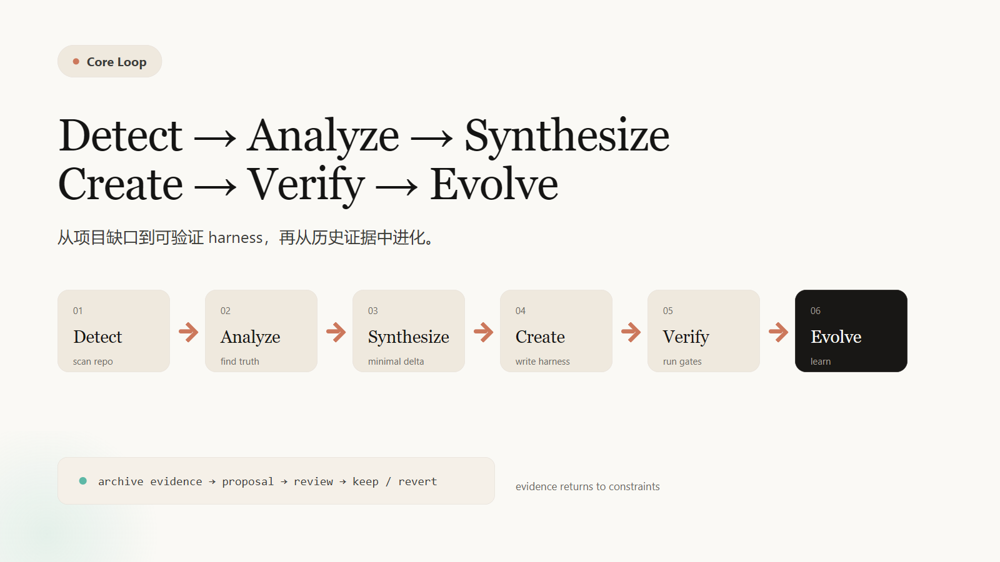
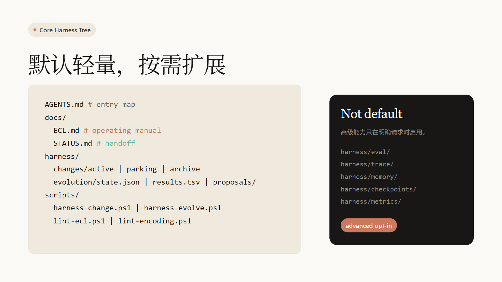
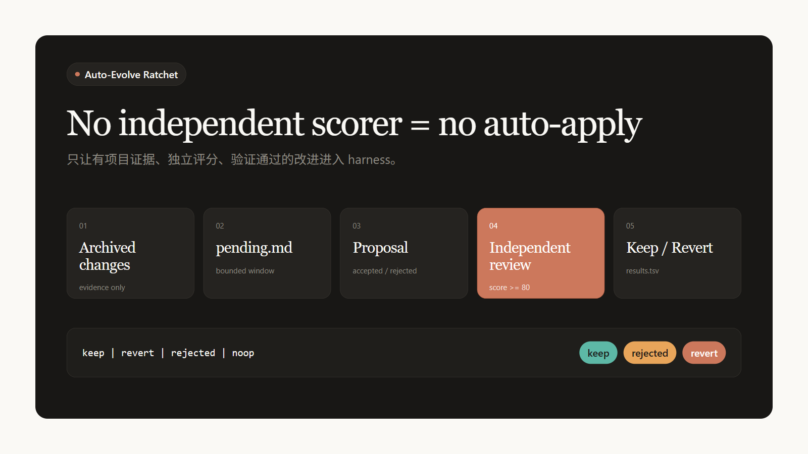

# ECL Harness Engineer



给项目装上 AI Agent 协作操作系统。

`ecl-harness-engineer` 是一个 Codex / Agent Skill，用来为代码仓库创建 **AI Agent 协作基础设施**：项目入口地图、ECL 变更流程、任务状态交接、机械校验、CI gate，以及基于历史变更的轻量 auto-evolve。


```bash
npx skills add qinghui316/ecl-harness-engineer
```

GitHub repo: [qinghui316/ecl-harness-engineer](https://github.com/qinghui316/ecl-harness-engineer)

---

## 为什么需要 Harness Engineering

普通项目交给 AI Agent 时，经常遇到这些问题：

- 冷启动：Agent 不知道项目是什么、从哪里开始、哪些文件重要。
- 误完成：代码写完就宣布完成，但没有跑验证。
- 上下文污染：一次性经验、文章建议、通用最佳实践被写进项目规则。
- 任务断档：上一次做到哪里、还有什么风险、下一步是什么，都散在对话里。
- 流程漂移：同类错误重复发生，但没有沉淀成 lint、测试或文档约束。

Harness Engineering 的目标是让仓库自己成为 Agent 的工作环境：**上下文在仓库里，约束在仓库里，验证在仓库里，历史也能回流到仓库里。**

---

## 核心循环



`ecl-harness-engineer` 采用一条统一流程：

1. **Detect**：识别项目状态、技术栈、已有 harness 缺口。
2. **Analyze**：分析架构、环境、文档、验证命令。
3. **Synthesize**：生成最小 delta，决定创建或补齐什么。
4. **Create**：写入 AGENTS、ECL、STATUS、脚本、lint、CI。
5. **Verify**：跑 harness 检查和业务 gate，区分新回归与历史债。
6. **Evolve**：从已关闭变更里提取证据，提出 harness 改进。

---

## 它会创建什么

默认创建的是 **core ECL harness**，不是完整 agent 平台。



```text
AGENTS.md                         # Agent 入口地图，不是长篇手册
docs/
  ECL.md                          # Evolution Constraint Language 操作手册
  STATUS.md                       # 无 active change 时的轻量交接状态
  ARCHITECTURE.md                 # 项目架构说明
  DEVELOPMENT.md                  # 开发与验证命令
harness/
  changes/
    active/                       # 当前任务上下文
    parking/                      # 暂停任务
    archive/                      # 已关闭任务
    INDEX.json                    # 脚本生成索引，不手写
  evolution/
    state.json                    # auto-evolve 阈值状态
    results.tsv                   # keep / revert / rejected / noop 记录
    proposals/                    # 进化提案
  templates/change/               # 变更模板
scripts/
  harness-change.{ps1|sh|mjs|py}  # new / park / resume / close / reindex
  harness-evolve.{ps1|sh|mjs|py}  # 阈值检查与 pending 生成
  lint-ecl.{ps1|sh|mjs|py}        # ECL 结构校验
  lint-encoding.{ps1|sh|mjs|py}   # UTF-8 / 乱码风险校验
```


## Auto-Evolve：让 Harness 从项目历史里进化



每关闭一定数量的 ECL changes 后，`harness-evolve check` 的等价脚本会生成：

```text
harness/evolution/pending.md
```

Codex 看到 pending 后，会从最近的 archived changes 里提取重复失败、用户纠正、验证缺口和可机械化规则，生成 proposal。

核心防退化规则：

> **No independent scorer = no auto-apply**

也就是说：

- 没有独立 auditor / subagent 评分时，只能生成 proposal，不能自动改 harness。
- 没有 archive 证据的候选项，只能进入 rejected candidates。
- 与当前项目文件、模块、命令、失败或用户纠正无关的建议，不能写进 AGENTS/ECL/STATUS/lint/CI。
- 分数不足、验证失败或污染范围过大时，记录 `rejected`、`noop` 或 `revert`。

这借鉴了 Darwin-style ratchet：**只保留有证据、可验证、分数达标的改进。**

---

## 快速开始

安装 skill 后，在项目根目录对 Codex 说：

```text
Use ecl-harness-engineer to add an ECL-aware harness to this project.
```

如果项目已有部分 harness，可以说：

```text
Use ecl-harness-engineer to audit this project harness and fill the ECL gaps.
```

如果你只想看计划，不想马上写文件：

```text
Use ecl-harness-engineer to propose the minimal core harness delta for this repo.
```

---

## 命令入口策略

Harness 脚本不强制使用 `.ps1`。`harness-change`、`harness-evolve`、`lint-ecl`、`lint-encoding` 可以生成 PowerShell、Bash、Node 或 Python 的等价实现，但必须保持同一组 ECL 约束和校验强度。

选择顺序：

1. 优先遵守目标项目已有入口：`package.json` scripts、Makefile、README 里的开发命令、CI 现有 shell。
2. 如果项目明确不接受 `.ps1`，不能把 PowerShell 脚本作为唯一入口。
3. Windows 项目可以选择 Bash profile，但必须在 `docs/DEVELOPMENT.md` 或 `harness/config/environment.json` 里写明前提：Git Bash、WSL、MSYS2，或 CI Linux runner。
4. TypeScript/Node 项目优先把 harness 命令挂到 npm/pnpm/yarn/bun scripts；脚本本体可以是 `.mjs` 或 Bash，按项目习惯选择。

一般不需要人工选择脚本形式。`ecl-harness-engineer` 应根据项目事实自动选择；只有现有证据互相冲突，或用户明确要求某种入口时，才需要确认。

示例：

```bash
bash scripts/harness-change.sh reindex
bash scripts/harness-evolve.sh check
bash scripts/lint-ecl.sh
bash scripts/lint-encoding.sh
```

---

## 推荐全局提示词

建议把下面这段放进 Codex / Agent 的全局 instructions，让所有项目先遵守本地 `AGENTS.md`、ECL、active change 和验证约束；只有项目还没有 Harness 时，才回退到简化闭环。

```markdown
# 全局开发原则：演进约束驱动

## 优先级

1. 优先遵守当前项目的 `AGENTS.md`、`docs/`、`harness/`、lint、CI 和本地开发命令。
2. 若项目存在 `docs/ECL.md`，按其中的演进约束语言流程执行。
3. 若项目存在 `harness/changes/active/`，先读取当前 active change，再继续任务。
4. 若项目没有 Harness，则使用本全局提示词中的简化闭环流程。
5. 若需要为项目创建或补全 Harness，可使用 `ecl-harness-engineer`。

## 核心原则

用户需求是待验证假设，不是事实。开发前应澄清目标、边界、依赖、风险和验收标准。

非平凡开发任务按以下闭环推进：

`需求假设 → 发散方案 → 约束收敛 → 实现 → 测试验证 → 问题回流`

编码必须能追踪到：

`需求 → 功能 → 模块 → 函数 → 测试`

发现新问题时，不只做局部补丁，应回流为新的约束、测试、文档或 lint 规则。

## Harness 使用规则

1. `AGENTS.md` 是地图，不是手册；详细流程应进入 `docs/ECL.md`。
2. `harness/changes/active/` 是当前任务上下文；不要覆盖未关闭的 active change。
3. `harness/changes/parking/` 存放暂停任务；`archive/` 存放已关闭任务。
4. `harness/changes/INDEX.json` 是脚本生成索引，不允许手写维护。
5. 规则能机器检查时，优先沉淀为 lint、test 或 CI。
6. hook/CI 只做校验，不自动写文档、不自动归档。

## 执行纪律

1. 不把第一方案直接当最终方案。
2. 对模糊、矛盾、缺失或可疑需求，先显式列出假设和待确认点。
3. 编码前确认当前约束足够支撑实现和测试。
4. 不修改无关文件，不回滚用户已有改动。
5. 不绕过项目测试、lint、CI 或 Harness 约束。
6. 小任务可不创建 change；跨多文件、接口、数据库、权限、架构、多步验证或预计超过 20 分钟的任务应创建/更新 change。
```

---

## 设计原则

| 原则 | 含义 |
|---|---|
| Repository as Source of Truth | Agent 需要的上下文必须在仓库里 |
| AGENTS.md is a Map | `AGENTS.md` 是入口地图，不是百科手册 |
| ECL Before Coding | 非平凡任务先明确证据、约束、验收和计划 |
| Mechanical Gates First | 能机器检查的规则优先变成 lint、test 或 CI |
| Evidence Before Rules | 没有项目证据，不写长期规则 |
| No Independent Scorer = No Auto-Apply | 没有独立评分，不自动进化 harness |
| Start Core, Add Advanced Later | 默认保持轻量，高级能力按需启用 |

---

## 它不做什么

- 不替你实现普通业务功能。
- 不默认生成 `eval/trace/state/memory/checkpoints/metrics`。
- 不把文章经验、通用最佳实践、模型猜测直接写进项目 harness。
- 不让 hook / CI 自动写文档、移动 changes 或修改 STATUS。
- 不把 `AGENTS.md` 写成又长又重的操作手册。

---

## 适合什么项目

适合：

- 需要多个 Agent 或多轮会话协作的项目。
- 经常因为上下文缺失导致 Agent 误改、漏测、重复踩坑的项目。
- 想把开发纪律沉淀为文档、lint、CI 和变更记录的项目。
- 想让项目 harness 随着真实历史逐步进化，但又不想让它失控膨胀的项目。

不适合：

- 一次性脚本。
- 没有长期维护价值的 demo。
- 只想让 Agent 直接写业务代码、不关心协作基础设施的场景。

---

## 参考与致谢

- [darwin-skill](https://github.com/alchaincyf/darwin-skill)：独立评分、棘轮机制、keep / revert 思路来源。
- [原版 Harness Skill / market.hiclaw.io](https://market.hiclaw.io/skills/product-69e7187be4b0d28be543a809)：Harness Engineering、ECL、Agent 协作基础设施方向参考。

本项目的视觉风格使用 warm cream / coral / dark navy 配色，但不隶属于 Anthropic / Claude，也不使用其 logo、wordmark 或专属品牌符号。

## License

MIT
