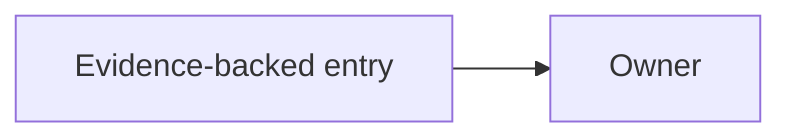

# Project Harness Documentation Templates

## Rules

- Populate every section from profile evidence; omit unsupported optional sections.
- Use project-relative source citations and stable owner IDs.
- Rewrite verified project knowledge into the project Harness. Repository prose is an analysis lead,
  not a durable citation or required navigation dependency.
- Entry routes are short; detailed behavior belongs to workflows/rules/Wiki/Change state.
- Do not create empty L2/L3 pages or placeholder catalogs.

## Managed Repository Route

The CLI owns an idempotent bounded block in existing AGENTS/Claude files:

```markdown
<!-- ECL-HARNESS:BEGIN -->
This project uses the local `<project-id>-harness` project Harness. If its project-level link is
missing in a new worktree, run `<host-native connector>` and reload the Skill. Single-Lane Small
Changes proceed with targeted verification; Structured and multi-Lane repository work publish scope
and run preflight before plan approval or editing.
<!-- ECL-HARNESS:END -->
```

Preserve content outside the block. Do not copy project maps, rules, Change history, or command
manuals into the route.

## Project Harness Entry

Use `assets/project-skill/SKILL.md.tpl` as the only entry template. Fill its identity, mode, and
launcher placeholders; project-specific detail belongs in project knowledge and workflows.

## L1 Overview

```markdown
# <Project> Overview

## Purpose
<Evidence-backed purpose and intended users/systems.>

## Primary Flows
- <Flow>: <bounded description> ([source](relative/path))

## Major Modules
| Module | Responsibility | Detail |
| --- | --- | --- |
| <name> | <one sentence> | [L2](modules/<id>.md) |

## Commands
| Purpose | Command | Status | Evidence |
| --- | --- | --- | --- |

## Global Boundaries
- <Boundary and evidence>

## Material Unknowns
- <Unknown that changes planning/verification>
```

Scale L1 to the project's complexity without a fixed byte or line limit. Exclude Lane state, Change
lists, complete directory trees, and history. Keep all project-level navigation needed by default,
and move descriptive implementation detail to L2/L3.

## L2 Module

```markdown
<!-- module_id: <id> -->
<!-- roots: [<path>] -->
<!-- source_fingerprint: <digest> -->

# <Module>

## Responsibility And Boundary
<What this module owns and does not own.>

## Entrypoints And Interfaces
| Symbol/path | Role | Evidence |
| --- | --- | --- |

## Data And Dependencies
<Owners, direction, consumers, forbidden/required boundaries.>

## Primary Flow


## Verification
| Scope | Command/test | Status | Evidence |
| --- | --- | --- | --- |

## Sources
- [relative/path](relative/path)
```

Generate a Mermaid graph only when real nodes/edges are proven. Do not paste a generic diagram.

## L2 System: Environment

```markdown
# Environment

## Modes
| Mode | Purpose | Evidence |
| --- | --- | --- |

## Services And Startup Order
| Order | Service | Required for | Readiness | Evidence |
| ---: | --- | --- | --- | --- |

## Variables
| Name | Required | Sensitive | Modes | Evidence |
| --- | --- | --- | --- | --- |

## Unknown Prerequisites
- <Do not guess>
```

Never include secret values.

## L2 System: Commands And Verification

```markdown
# Commands
| Purpose | Category | Command | CWD | Status | Last result | Evidence |
| --- | --- | --- | --- | --- | --- | --- |

# Verification
| Gate | When required | Command/scenario | Baseline | Evidence |
| --- | --- | --- | --- | --- |
```

Statuses are configured/candidate/executed. A candidate is visibly not a project fact.

## L3 Bridge

```markdown
<!-- bridge_id: <id> -->
<!-- source_fingerprint: <digest> -->

# <Translation Boundary>

## Scope
<Why project language and implementation names differ.>

## Mappings
| External/product term | Code/API owner | Evidence |
| --- | --- | --- |

## Unknown Or Ambiguous Mappings
- <Candidate that must not be used as durable truth>
```

Every durable row needs source code, manifest/configuration, an integrated contract, a test, or
explicit user evidence.

## Workflow

```markdown
# <Stage>

## Inputs
## Agent Judgment
## Deterministic Commands
## Actions
## Outputs
## Exit
## Stop And Escalate
## Rules
```

Reference stable rule IDs instead of restating rules.

## Change Templates

Use the actual templates under `assets/project-skill/assets/templates/` as the single template
owner. They preserve:

- summary phase/outcome/decisions/validation/risk/next step;
- spec intake/evidence/scenarios/AC/non-goals/constraints/assumptions/clarifications;
- plan approach/owners/interfaces/data/permissions/spec gaps/risks/verification/review;
- tasks IDs/AC/path/validation and deferred work;
- review intake/spec/plan/code/validation/contract/Integration/knowledge/entropy coverage.

Do not duplicate complete Change templates in this reference; validate the actual assets instead.

## Architecture And Quality Projection

Express useful architecture knowledge directly through evidence-backed maps:

- package/component dependency graph;
- layer hierarchy and forbidden edges;
- request/job/data/error flow;
- key interfaces/types and implementations;
- design decisions and verification surfaces;
- logging/error/naming/template conventions that are accepted project invariants.

Generate a project Harness mechanical check only when the analyzer proves the invariant and the
creation delta accepts its owner and validation. Otherwise record an audit recommendation.

## Entropy Review

Before publishing:

- entry contains no phase/archive ledger;
- L1 contains no Change/Lane history;
- module facts have one L2 owner;
- rule text has one YAML owner;
- current Change facts live in Change summary/Registry;
- closeout narrative remains in archive;
- stale current-plan/baseline language is merged, retired, or archive-only;
- all links and citations resolve.

## Canonical Project Documents

These templates are available when analysis or a greenfield Change proves the project needs a
human-facing business document. They are business-repository artifacts created through an accepted
Change, not Harness-init outputs and not project Harness knowledge dependencies.

### Architecture Document

```markdown
# Architecture

## 1 Overview
<Purpose, runtime shape, and authoritative scope.>

## 2 Dependency Structure
<Evidence-backed package/component graph and layer direction.>

## 3 Components
| Component | Responsibility | Entrypoint | Interfaces | Dependencies |
| --- | --- | --- | --- | --- |

## 4 Primary Flows
<Request, command, job, data, and error flows with source citations.>

## 5 Boundaries
<Required and forbidden dependencies, API/schema/event owners, trust boundaries.>

## 6 Decisions
<Current decisions with rationale; history links instead of duplicated closeout narrative.>

## 7 Verification
<Commands/tests that prove architecture-critical behavior.>
```

### Development Document

```markdown
# Development

## 1 Prerequisites
<Supported runtime/tool versions and externally managed dependencies.>

## 2 Setup
<Configured setup command and required variable names; no secret values.>

## 3 Commands
| Purpose | Command | Working directory | Expected prerequisites |
| --- | --- | --- | --- |

## 4 Runtime Modes And Services
<Startup order, readiness, migration/seed, cleanup, and unknowns.>

## 5 Project Structure
<Major evidence-backed owners, not a complete directory dump.>

## 6 Troubleshooting
<Observed failure, attribution, and actionable diagnosis.>
```

### Testing Document

```markdown
# Testing

## 1 Test Levels
<Unit, integration, contract, system, and UI levels actually used.>

## 2 Commands
<Configured commands and working directories.>

## 3 Fixtures And Services
<Ownership, readiness, isolation, and teardown.>

## 4 Scenario Coverage
| Scenario/AC | Test owner | Command | Evidence |
| --- | --- | --- | --- |

## 5 Failure Attribution
<introduced, pre-existing, environmental, blocked.>
```

### Security Document

```markdown
# Security

## 1 Trust Boundaries
<Inputs, identities, permissions, external providers, sensitive data.>

## 2 Secret Handling
<Variable names and provisioning owner; never secret values.>

## 3 Input And Output Validation
<Schemas, sanitization, authorization, error exposure.>

## 4 Dependency And Supply Chain
<Locking, scanning, update policy, generated artifact trust.>

## 5 Security Verification
<Current tests/checks and responsible owner.>
```

### Product Sense Document

```markdown
# Product Sense

## 1 What The Project Does
## 2 Target Users Or Systems
## 3 Primary Outcomes And Priorities
## 4 Domain Vocabulary
## 5 Non-Goals
## 6 Evidence And Open Questions
```

Create this only from user-confirmed or canonical product evidence. It is useful for greenfield or
domain-heavy projects and harmful when populated with generic product language.

### Design Document

```markdown
# <Component Or Change>

## 1 Problem And Constraints
## 2 Accepted Design
## 3 Interfaces, Types, Schema, Events, And Configuration
## 4 Execution And Error Flows
## 5 Alternatives And Tradeoffs
## 6 Migration And Compatibility
## 7 Verification
## 8 Open Questions
```

### API Reference

```markdown
# API Reference

## 1 Ownership And Compatibility
## 2 Authentication And Permissions
## 3 Endpoints Or Commands
| Operation | Input schema | Output schema | Errors | Owner |
| --- | --- | --- | --- | --- |
## 4 Events And Side Effects
## 5 Examples Backed By Tests
```

Do not invent endpoints or examples. Prefer generated schema/API documentation when it is the
canonical owner, and let L3 bridge product terms to those owners.
